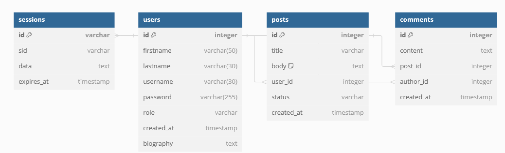

# Blog API
Backend RESTful API of a blog website with Typescript, Node, Express, PostgreSQL, authentication with Passport local startegy + JWT and PrismaORM for database interactions.  <br>
**Demo**: :point_right:[**Not yet ready**]():point_left:. <br>
Please allow up to 1 minutes for the website to load.
## Install and set up
Follow these step below to set up the website in your local machine.

### Prerequisites:
Ensure [Node](https://nodejs.org/en) and [npm](https://www.npmjs.comnode) are installed in your computer.
### Steps:
1. Clone the repo: <br>

```bash
git clone https://github.com/YourUserName/simplified-google-drive
```

2. Navigate to the project folder:<br>

```bash
cd blogAPI
```

3. Install the dependencies:<br>

```bash
npm install
```

4. Create the .env file:<br>

```bash
touch .env
```

5. Add your environment inside the file: <br>

```bash
DATABASE_URL=
FOO_COOKIE_SECRET=
```

6. Start the dev server:<br>

```bash
npm run dev
```


After these step, you should browser and navigate to http://localhost:3000 to view the application in action.
## Production:

To prepare the project for production deployment, please use the following command: <br>

```bash
npm start
```

## Current route:

```bash

POST /admin/login
Description: Authenticates an admin and returns a token.
Requires: None
Headers: CORS enabled

POST /admin/signup
Description: Registers a new admin user.
Requires: Admin details in request body
Headers: CORS enabled
User Routes

POST /users/signup
Description: Registers a new user.
Requires: User details in request body
Headers: CORS enabled

POST /users/login
Description: Authenticates a user and returns a token.
Requires: Username and password in request body
Headers: CORS enabled

GET /users/:userId
Description: Retrieves user information by user ID.
Requires: Token in the Authorization header
Headers: CORS enabled

PUT /users/:userId
Description: Updates user information by user ID.
Requires: Token in the Authorization header, user details in request body
Headers: CORS enabled

DELETE /users/:userId
Description: Deletes a user by user ID.
Requires: Token in the Authorization header
Headers: CORS enabled
Post Routes

GET /posts
Description: Retrieves a list of posts.
Requires: Token in the Authorization header
Headers: CORS enabled

GET /posts/:postId: Retrieves a specific post by post ID.


POST /posts: Creates a new post.


PUT /posts/:postId: Updates a post by post ID.

PATCH /posts/:postId: Toggles the active status of a post by post ID.


POST /posts/:postId/comments
Description: Adds a comment to a post by post ID.
Requires: Token in the Authorization header, comment details in request body
Headers: CORS enabled

DELETE /posts/:postId
Description: Deletes a post by post ID.
Requires: Token in the Authorization header
Headers: CORS enabled
```

## Tech stack:
+ [Node](https://nodejs.org/en) as runtime environment. <br>
+ [Express](https://expressjs.com/) as backend framework. <br>
+ [PostgreSQL](https://www.postgresql.org/) SQL database for storing user, folder, and file information. <br>
+ [TypeScript](https://www.typescriptlang.org/) strongly-typed language for building robust and scalable applications. <br>
+ [Passport](https://www.passportjs.org/) Authentication middleware for managing user authentication and session handling in Node applications. <br>
+ [Prisma](https://www.prisma.io/) Simplified database relation and query for SQL and NoSQL databases. <br>
+ [Postman](https://www.postman.com/) API platform for building, testing and using APIs. <br>
+ [JWT](https://www.npmjs.com/package/jsonwebtoken) Securely transmitting information between parties as a JSON object.
## Database design:
